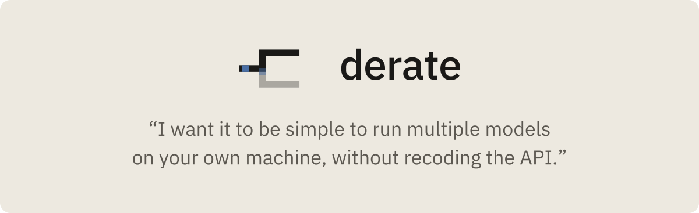
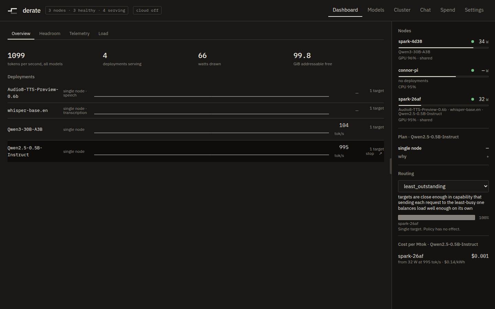
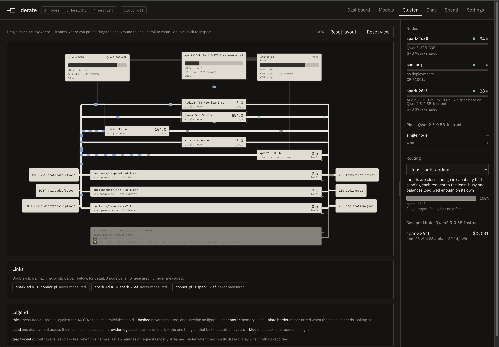
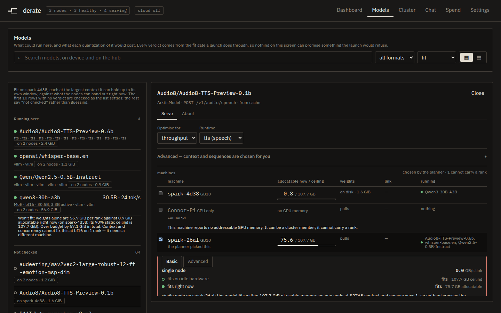
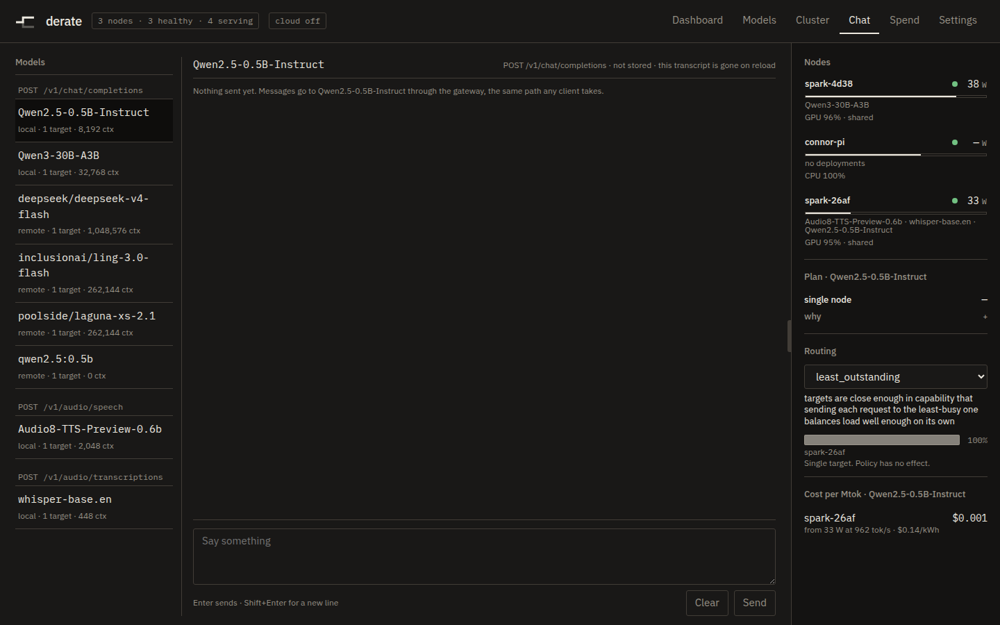
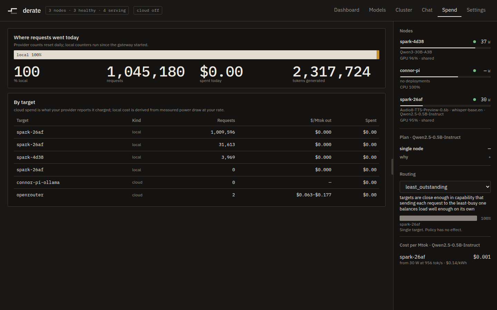
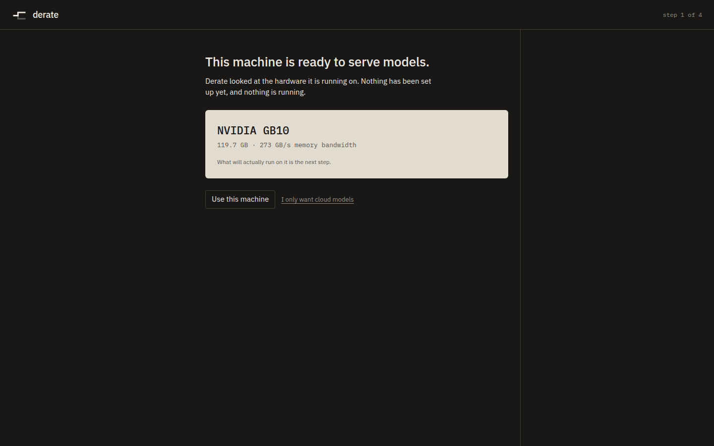

<p align="center">
  <picture>
    <source media="(prefers-color-scheme: dark)" srcset="docs/brand/derate-banner-dark.svg">
    
  </picture>
</p>

I started this while bringing up an agent swarm for Jarvis, my self-hosted coding agent. The containers kept crashing and I had no way to watch them — which one died, why, or whether it ever had the memory to run at all. So I built derate. Built it in 48 hours, 32 of them spent actually building.

Planning and orchestration for DGX Spark clusters, for any model you want to run. It measures how fast your machines actually talk to each other, works out from that how to split a model across them, refuses launches that would run out of memory, and puts every model behind a single endpoint.

## The demo

Two machines, two `curl` lines — **Install** below is both of them. The second joins the first and appears as a member. Launch a model that will not fit on one. The plan panel says pipeline parallel, names the measured 10.2 GB/s link as the reason, and lists tensor parallel as rejected.

That is the sixty seconds: it measures the link, disagrees with the vendor playbook, and shows the arithmetic it disagreed on.

## Screenshots

<table>
<tr>
<td width="50%"><br><sub>Dashboard — every deployment, every node, live</sub></td>
<td width="50%"><br><sub>Cluster — the measured interconnect, drawn as a graph</sub></td>
</tr>
<tr>
<td width="50%"><br><sub>A refusal, and the arithmetic it's based on — same gate, same numbers, either way it comes out</sub></td>
<td width="50%"><br><sub>Chat — talks to the endpoint over the same route any client does</sub></td>
</tr>
<tr>
<td width="50%"><br><sub>Spend — local cost from measured watts, cloud cost as billed</sub></td>
<td width="50%"><br><sub>First run — a five-step walkthrough on a fresh install</sub></td>
</tr>
</table>

More: [`models`](docs/screenshots/models.png) (fit verdicts against every model on the hub), [`settings`](docs/screenshots/settings.png) (coordinator, cluster, and node config).

## How it works

derate does not run inference. vLLM and SGLang do that, and NVIDIA's `sparkrun`
sets up the fabric and launches the processes. derate measures the interconnect,
resolves the model to a shape, plans the parallelism from the two, refuses
launches that will not fit — naming the term that blew the budget and the change
that would work — and fronts the result behind one endpoint. Every one of those
is decided from a measurement rather than a default. `00-architecture.md` has
the reasoning; `docs/CONTRACTS.md` has the numbers.

## Install

**Linux only today.** The install script sets up a container, and the flags
it passes are Linux-host features: `--network host` does not reach the LAN
under Docker Desktop, `--gpus` needs the NVIDIA container toolkit, and
`--pid=host` has no host to name. macOS and Windows are on the roadmap.

1. **Run this on machine one.** It becomes the coordinator and serves the UI
   on `:8080`. That alone is a working single-node cluster.

   ```bash
   curl -fsSL https://raw.githubusercontent.com/Pizzaman213/derate/main/install.sh | sh
   ```

2. **Open `http://<machine one>:8080`.** A setup walkthrough runs on the first
   visit and takes five steps — read the machine, add a cloud provider if you
   want one, pick a first model and check it against the fit gate, add more
   machines, done. It ends by handing you the endpoint, with a QR code so a
   phone can reach it without anybody typing an IP address.

3. **Settings → Add a node is where a node's token comes from.** There is
   nowhere else to look. Press it and the coordinator mints an **enrollment
   token** and composes this whole next line for you — its own address and the
   token already filled in — ready to copy. The same card lists the nodes that
   turn up after it runs.

   ```bash
   curl -fsSL http://<coordinator>:8080/install.sh | sh -s -- \
       --join http://<coordinator>:8080 --token ej_...
   ```

4. **Run that on machine two.** The token lasts an hour and is spent by the
   machine that uses it, so the node is admitted on arrival: no approval step,
   nothing to click.

The permanent cluster token is a different thing, and it is not what you carry
around — it only makes a *candidate*. A node that reaches the coordinator
without a live enrollment token, over mDNS or with that permanent token, waits
instead; Settings → Add a node is also where you admit it.

One image, one container, role decided at runtime. The script checks Docker,
pulls `ghcr.io/pizzaman213/derate/node`, and runs it with host networking and a
data volume; `--dry-run` prints the `docker run` it would use and stops,
`--uninstall` reverses it. That `docker run` is the whole of what it does, and
is still supported by hand:

```bash
docker run --network host --gpus all --pid=host \
    -v derate:/data ghcr.io/pizzaman213/derate/node
```

`--gpus all` because the hardware probe is `nvidia-smi`, and a container
without one probes as unidentified hardware the planner will not place work
on — a node that joins, reports healthy, and shows zeros. `--pid=host`
because on GB10 per-process accounting is the only memory number nvidia-smi
will still give you, and it only counts processes in its own namespace.
`install.sh` passes both for you.

## One endpoint

`control_plane/gateway/` is the only HTTP surface: 77 routes on the
coordinator, of which `/v1/models`, `/v1/chat/completions`, `/v1/completions`,
`/v1/embeddings` and the audio routes are the OpenAI-compatible ones. Every
model in the cluster is listed there, whether it is a deployment this control
plane launched or a model on a remote provider.

Routing is per served name — `least_outstanding` by default, with
`weighted_capacity` for unequal nodes, `cache_affinity`, `failover`,
`cost_aware`, and `local_first` to spill to a remote provider when the local
one saturates. Weights are recomputed on a 60 second cadence so a thermally
throttling node sheds share on its own, while outstanding counts and the
admitting flag are re-read on every selection, so a critical memory event takes
effect on the next request rather than at the next refresh.

`control_plane/providers/` makes OpenRouter, OpenAI, Anthropic, Together,
Groq, Ollama, and any OpenAI-compatible URL as `custom` into ordinary route
targets. No API key is ever rendered:
responses are scrubbed on the way to the screen, and there is no inverse.

## The cluster

A node announces itself over mDNS and the coordinator holds the roster;
`control_plane/registry/` owns discovery, join, health and telemetry. One image
and one container serve both roles, decided at runtime — there is no separate
worker build, which is why **Install** below is nearly the same line twice.

Nodes are not assumed to be identical. The fit gate budgets against the
smallest one, and a machine that cannot carry
a tensor- or pipeline-parallel rank — a Raspberry Pi, anything without an
NVIDIA GPU, anything not launching through `sparkrun` — says so in the roster
rather than implying otherwise.

<p align="center"></p>

## The screen

`ui/` is a React app the gateway serves itself, at the same origin as the API —
`/dashboard`, `/models`, `/cluster`, `/chat`, `/spend`, `/settings`, and
`/setup`. The path names the screen and its subject
(`/models/meta-llama/Llama-3.1-8B`); the query names what is selected
(`?node=`, `?link=`, `?dep=`). Every screen has a real URL, so a link to one
node's page is a link somebody can send.

There is no UI test runner. The gate is `tsc -b` plus a set of `*.check.mjs`
verifiers, each of which exists because a specific class of bug is invisible to
types, and `npm run screens` drives a real browser over every destination and
writes a PNG — the only thing here that sees what shipped rather than inferring
it from source.

## Where things live

| Package | What it does |
|---|---|
| `control_plane/contracts/` | The frozen types every other package agrees on |
| `control_plane/registry/` | Node agent, mDNS discovery, join, health, telemetry |
| `control_plane/links/` | Measures real interconnect bandwidth. The number everything turns on. |
| `control_plane/resolver/` | HuggingFace id to `ModelShape`. Owns the quantization table. |
| `control_plane/fit/` | The blocking out-of-memory gate. Refuses, and says what to change. |
| `control_plane/planner/` | Chooses TP, PP, EP from measured facts |
| `control_plane/deploy/` | sparkrun adapter, launch lifecycle, progress classification |
| `control_plane/gateway/` | One OpenAI endpoint, routing, admission control, and the built UI |
| `control_plane/providers/` | OpenRouter and other remote upstreams as route targets |
| `control_plane/runtimes/` | The inference servers derate ships itself. Runs inside a model container. |
| `ui/` | The screen. Cluster graph, plan panel, refusal states. |

## Voice and TTS

The OpenAI surface covers audio as well as text:

```
POST /v1/audio/speech            text in, audio bytes out
POST /v1/audio/transcriptions    audio file in, text out
GET  /v1/realtime                websocket, relayed to a provider
```

`GET /v1/models` reports a `modality` per model (`text`, `embedding`, `speech`,
`transcription`), and naming a model on the wrong endpoint is refused with the
one that would have worked. That matters even if you never serve audio
yourself: an OpenAI or OpenRouter catalog is ingested wholesale, so `tts-1` and
`whisper-1` arrive as ordinary models, and without the modality they show up in
the chat picker as if they were chat models.

Four ways to serve audio, cheapest first:

1. **A remote provider.** Add OpenAI or Groq and their audio models are routed
   like any other.
2. **An OpenAI-compatible server on the LAN** — Kokoro-FastAPI,
   openedai-speech, faster-whisper-server. Add it as a `custom` provider with
   its base URL; nothing needs to be launched by the control plane.
3. **A Whisper deployment the control plane launches**, on vLLM. Planned,
   fit-checked and launched like any other model; it is recorded as a
   transcription deployment, so it is offered on `/v1/audio/transcriptions` and
   kept off the chat routes.
4. **A TTS deployment the control plane launches**, on the `tts` runtime —
   derate's own server (`control_plane/runtimes/tts.py`), because neither vLLM
   nor SGLang serves `/v1/audio/speech` at all and neither will load a
   text-to-speech checkpoint's architecture. Pick the model, pick `tts`, press
   Serve: it is planned, fit-checked and launched like any other deployment,
   and it answers `POST /v1/audio/speech` behind the same gateway as
   everything else.

   ```bash
   curl localhost:8080/v1/audio/speech \
     -H 'content-type: application/json' \
     -d '{"model": "audio8-tts", "input": "The link is measured, not assumed.",
          "response_format": "mp3"}' --output line.mp3
   ```

   It writes `wav`, `mp3`, `flac`, `opus` and `pcm`; `aac` is refused by name
   rather than served as something else. `speed` is refused too — resampling
   moves the pitch, and a 1.5× that quietly returned a chipmunk would be worse
   than a sentence saying so. It generates one request at a time, so
   `--max-num-seqs` bounds how many callers may be waiting and the rest get a
   503 the router already knows how to hold.

   These checkpoints clone a voice zero-shot from a reference clip plus that
   clip's exact transcript, so a "voice" is a file pair. Point the runtime at a
   directory of them (`DERATE_TTS_VOICE_DIR`, or `--voice-dir`), one
   `<name>.wav` beside one `<name>.txt`; `GET /v1/audio/voices` lists what
   loaded and what was skipped. Omit `voice` entirely and the model speaks in
   its own. An unknown voice is refused, naming the ones installed — returning
   a different speaker under a 200 is the failure you cannot hear until
   somebody else does.

   Verified on a GB10 against `Audio8/Audio8-TTS-Preview-0.6b`, a 0.6B DualAR
   model with a 44.1 kHz codec: 4.4 seconds of speech in 4.3 seconds of wall
   clock, and 2451 MiB resident against the fit gate's predicted 2.3 GiB.

An audio deployment reports `—` rather than a token rate, in the strip and in
the inspector. There is no audio-side rate measured today, and a zero would
read as a stalled deployment.

## License

MIT — see `LICENSE`. Use it for anything, commercial included, without asking.

If you are running derate in production, please open an issue first and say
what you are building on. The gateway has no inbound authentication yet, and
there are things worth knowing about sizing and placement that are cheaper to
hear before the deploy than after it.
