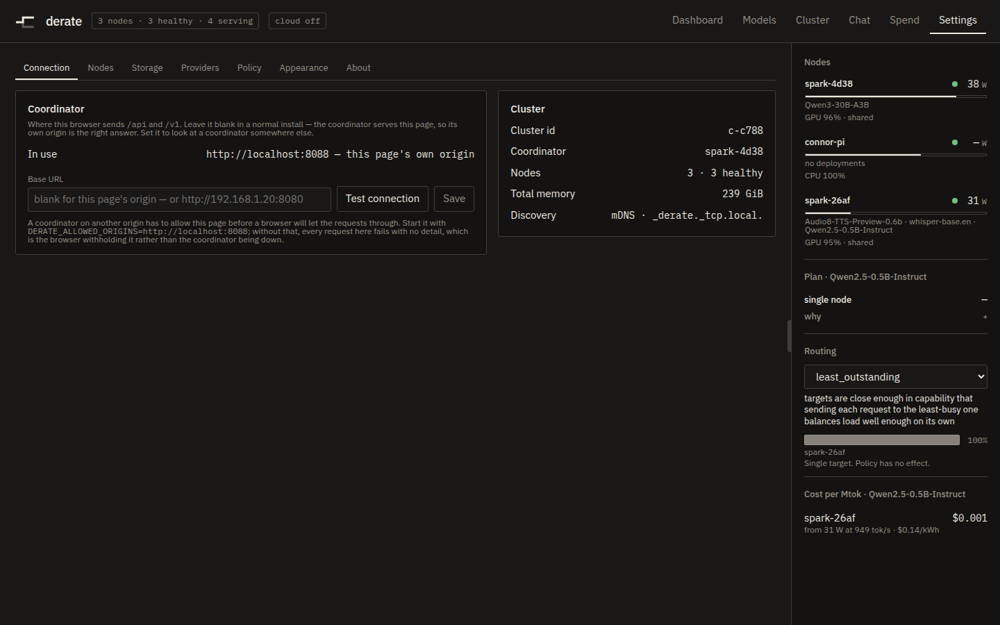

# Your first visit to the coordinator

The first time you open a coordinator that has nothing configured, it sends you
to a walkthrough instead of the dashboard. This page is what that walkthrough
asks, and where a second machine's join command comes from afterwards. You need
the address the installer printed.


## Open it

Use the `ui:` line the installer printed — for example `http://192.168.1.10:8080`.

The redirect to the walkthrough happens once, and only if you landed on the
dashboard. A person who typed a URL, followed a link or clicked a tab has said
where they want to be, and being yanked out of it because a request came back
late is worse than never being offered setup at all. `/setup` is a real
destination with a real URL, so you can open it directly at any time:

```
http://192.168.1.10:8080/setup
```

The walkthrough stops being offered once this cluster is serving a model or has a
provider configured, or once you have reached the end of it. Those are checked in
that order, so a cluster that is plainly in use is never dropped back into
onboarding.

The walkthrough has no header, no roster and no sidebar. On a fresh install none
of them have anything in them, and a frame around four empty panels is a worse
first impression than no frame.

## The four steps, and the handover

The top right corner counts them: `step 1 of 4`, then `ready` on the last
screen. If no cloud provider can be added and routed to on this build, the cloud
step is not rendered at all — not disabled, not explained — and the count reads
`step 1 of 3`.

### Step 1 — this machine

```
This machine is ready to serve models.
```

Under it: the GPU name, the memory, and the measured memory bandwidth. Nothing
on this screen is computed by the screen; it is the same row the cluster graph
reads, so the two cannot disagree about whether this machine can be used.

If the probe could not confirm the hardware, the heading is
`This machine is running, but its hardware is not confirmed.` and the caption
under the plate is the reason. That is the `--gpus all` failure described on the
[install page](install.md) — go and fix it there, because the planner will not
place work on this machine until it is fixed.

Press **Use this machine**, or **I only want cloud models** to skip past it.

There is a third possibility. If the coordinator cannot tell which of several
machines on the roster is itself, it declines to name one rather than
introducing somebody else's GPU as the box under your desk:

```
This coordinator has not identified its own hardware yet.
```

### Step 2 — a cloud provider, if you want one

```
Add a cloud provider as backup?
```

Optional, and it takes an OpenRouter key. With one connected, derate keeps using
your machine and only reaches for the cloud when your machine is already busy.
The field is a password field and the note under it is the whole policy:

```
Stored on the coordinator and never shown again, not even to you.
```

No API key is ever rendered anywhere in this product. Responses are scrubbed on
the way to the screen and there is no inverse, so if you lose the key you replace
it rather than reading it back.

**Add key**, or **Skip — local only**. Other provider kinds are added later from
Settings → Providers; this step exists to get one working route on day one.

### Step 3 — pick something to run

```
Pick something to run.
```

Five models, smallest first, every one of them a repository that is already
4-bit — AWQ, GPTQ or w4a16. That is deliberate: the weights are about a quarter
of the equivalent 16-bit download, and the download is the wait a first run
actually feels.

```
Qwen/Qwen2.5-0.5B-Instruct-GPTQ-Int4
Qwen/Qwen3-4B-AWQ
RedHatAI/Mistral-7B-Instruct-v0.3-quantized.w4a16
RedHatAI/Meta-Llama-3.1-8B-Instruct-quantized.w4a16
Qwen/Qwen3-30B-A3B-GPTQ-Int4
```

Each row carries three facts down its right-hand side: a predicted decode rate
(`18 tok/sec`, or `no estimate`), the quantization it would run at (`awq_int4`),
and the context that verdict was taken at (`at 32k context`). The context is
printed with the speed because the two are not separable: each row is judged at
its own context, so decoding one token reads a different amount of cache per
row, and without the denominator the numbers look comparable and are not. A row
that does not fit says `will not fit` in place of the quantization and cannot be
pressed.

The footnote tells you which budget the verdicts came from:

```
Measured against the memory this machine can hand out right now.
```

or, when no live reading has arrived yet:

```
Measured against this machine's stated memory ceiling; no live reading yet.
```

Pressing a row launches it at exactly the context and concurrency the verdict was
taken at, and the screen switches to a five-step stepper: **Preparing the
machine**, **Downloading weights**, **Loading onto the GPU**, **Starting the
engine**, **Serving**. Beside the current step sits the launcher's or the
runtime's own sentence, passed through unedited — `Loading safetensors checkpoint
shards: 5/11`, `Capturing CUDA graphs`. It is the only thing on the screen that
says which of several minutes-long things is happening right now.

There is no percentage for the download. Nothing reports the repository's final
size before it finishes, so what you get is the real number of gigabytes that
have landed in this machine's model cache with the rate beside it. The bar fills
only while the runtime is counting its own shards onto the GPU, which is the one
step of a launch that measures itself.

**Starting the engine** is the slow one, and it is not "nearly done": the engine
compiles itself and captures CUDA graphs there, which on a first launch is
minutes with no download to explain it. Later launches of the same model reuse
what was compiled.

You do not have to watch it. **Continue while it loads** moves on.

If the launch is refused or dies, the heading is `<model> did not start.` and the
message underneath is printed exactly as it arrived. That is the point of it: a
refusal from the fit gate names the term that blew the budget and the change that
would work, and the screen is not entitled to summarise it. **Pick something
else** goes back to the list.

### Step 4 — another machine

```
Add another machine?
```

The coordinator mints an enrollment token and composes the whole command, with
its own probed address in it, before this screen renders. Copy it and run it on
the other machine.

```
This is the only step that needs a terminal, and only on the machine being
added. Nothing to install on this one. The token in that line expires in 60
minutes.
```

**A machine joined**, or **Skip — just this machine**. Neither answer is checked
against the roster; the ledger at the top of the screen is recording what you
said, and you can press **Change** on any line to go back.

### Ready — the endpoint

The last screen hands over the address other applications use:

```
http://192.168.1.10:8080/v1
```

Beside it is a QR code carrying that same string, so a phone gets it without
anybody typing an IP address. The address comes from the coordinator's own probed
address, not from the browser's — the browser's is right in production and a lie
in development, and this is the address you type into another machine. If you
launched a model, the model name is printed under it, with `No other settings.`

**Open the dashboard** finishes. Reaching this screen is what records the
walkthrough as done.

## Adding a machine later



**Settings → Nodes → Add a node.** That card is where a node's token comes from
and there is nowhere else to look. It has two commands and they are not
interchangeable.

**The first node** — shown always, including on a cluster that already has a
coordinator, because it is the command for the machine you have not set up yet.
It carries no credential and points at the repository, since a machine with no
cluster has nothing to fetch a script from.

**Add to this cluster** — press **Generate join command**:

```
Generates a command with a one-hour token in it. The token admits one machine
and is spent when it does.
```

What comes back is the line to run on the new machine, a short token id in a
pill, a live countdown, and **Revoke** and **Regenerate** buttons:

```
Run this on the new machine. It installs, joins, and is admitted — there is
nothing to click afterwards.
```

The token is shown once. There is no reveal control and no endpoint that returns
a token you already minted, so a token minted in another tab or before a refresh
is listed only so you can revoke it — `another live token · expires in 47:12 ·
its command cannot be shown again`. Minting another costs nothing.

When the countdown reaches zero:

```
That command has expired. Generate another — it costs nothing.
```

Under the command, the card watches for what turns up. Until something does:

```
Run the command above on the other machine. It appears here within a few
seconds of the container starting.
```

A machine that used the token appears with a `joined` pill, its GPU, its memory
and its address. Nothing else is required of you.

## The two tokens, and why one of them waits

This is the distinction that decides whether adding a machine takes a click.

An **enrollment token** (`ej_...`) is minted on demand from Settings → Add a
node. It lives one hour by default, is spent by the first machine that uses it,
and can be revoked. Minting it *is* the admission decision, made in advance — so
the machine that presents it is admitted straight to **member** on arrival.

The **permanent cluster token** is the other thing entirely. It is generated on
the coordinator's first start, printed once to that machine's own terminal, and
never returned by any endpoint. Carrying it to another machine works, and it only
ever gets you **candidate** status:

```
This machine reached http://192.168.1.10:8080 and is waiting to be admitted.
Open the UI at http://192.168.1.10:8080, go to Settings, and click Admit next to it.

A token from the UI's "Add a node" card admits automatically.
The permanent cluster token does not, by design.
```

A machine discovered over mDNS with no token at all lands in the same place. Both
show up in the Add a node card, and in the Nodes card below it, with a
`discovered` pill and an **Admit** button. Press it and the node becomes a
member.

The Admit button is never disabled, including on a machine whose device class
could not be confirmed. That verdict means "cannot confirm", not "excluded" —
nothing in the planner or the fit gate filters placement on device class — so the
reason is printed next to the row and the decision is yours. It is the machines a
human is most likely to be adding by hand, a Mac or a Pi, that hit that case.

A node admitted either way is handed the permanent cluster token on the way in.
An enrollment token expiring later cannot lock an established member out of its
own cluster.

Keep the permanent token somewhere. It is what makes the coordinator
replaceable: start a coordinator anywhere with `DERATE_TOKEN` set to it and every
node presents itself again on its own. If you need to read it back:

```bash
docker exec derate cat /data/cluster.json
```

## What can go wrong here

**`This coordinator did not answer.`** — setup asks the coordinator what machine
it is running on before it shows you anything, and that request failed. The
error is printed underneath, and there is a **Try again** button. The
coordinator may still be starting.

**The model list will not load.** Resolving five models means five requests to
Hugging Face. After ten seconds the screen stops spinning and says so:

```
Still waiting after 12 seconds. Hugging Face may be slow or unreachable from
this machine. Nothing is stuck on your side, and you can come back to this from
the Models screen.
```

**`Nothing here fits this machine yet.`** — the verdicts are real. Add a cloud
provider, or another machine, and come back to this from the Models screen.

**Every row is greyed out** and this appears above them:

```
These verdicts are real, but this coordinator cannot start a model itself — it
has no local runtime. It can still route to a cloud provider, and to other
machines that join it.
```

**A model id is called out by name** — `<id> could not be read: <reason>`. Said
out loud rather than silently dropped, because a list that quietly shrinks
cannot be told apart from one that was always that short. A gated repository is
the usual cause.

**The browser will not copy the command.** `This browser would not copy it.
Select the line above instead.` The clipboard API is only available in a secure
context, and the coordinator is served over plain HTTP on a LAN address. The
command block is selectable text — select it and copy it by hand.

**The walkthrough will not go away.** If the coordinator could not write the
one-line file that records it, it says so and keeps everything else:

```
Setup finished, but this coordinator could not record that it did: <error>.
Everything you configured is saved; only the reminder to set up is. Check that
the data directory is writable.
```

**Somebody else opened the coordinator and added a node.** The gateway has no
inbound authentication yet. Anyone who can reach port 8080 can mint an
enrollment token, admit a candidate, and launch a model. Treat the port as the
boundary.

---

**Next:** the [project README](../../README.md) covers the endpoint every app
points at, the routing policies behind it, and what a refusal from the fit gate
is telling you.
