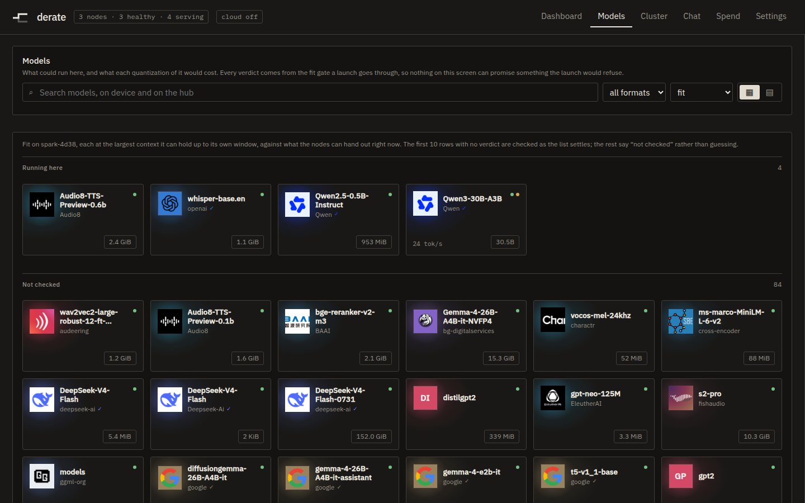

# Serving a model

This page takes you from "I want to run this model" to a deployment answering
on your own endpoint. You need derate installed and its coordinator reachable
at `http://<coordinator>:8080`, with at least one node in the roster. You do
not need to know in advance whether the model fits — working that out is what
most of this page is about.

## Find the model

Open `http://<coordinator>:8080/models`.



It is one list, folded over five sources on the coordinator: what is running
here, what your providers actually serve, what they merely publish, a short
curated shortlist, and what is already on disk. Hub search results fold in on
top of those. A model that is curated, cached **and** serving is one row that
says all three, not three rows each saying a third of it.

The search box reaches everything at once:

```
Search models, on device and on the hub
```

Rows are grouped into bands, and the band is the fit gate's answer, not a
category somebody chose. The band titles, in the order they draw:

```
Running here
Fits here
Loads, but decode is slow
Not checked
Needs more memory
Runs on a provider, not here
Not served
```

`Not served` is the only band that opens collapsed. It is a provider's whole
catalogue — several hundred models nobody picked — and it sits at the bottom
with a line saying whose it is, like `from OpenRouter`.

`Not checked` is not a fourth verdict, it is the absence of one. Hub search
resolves nothing, so a hub hit has no fit answer until something asks for one.
The caption above the list says what was checked and what was not:

```
The first 10 rows with no verdict are checked as the list settles; the rest
say “not checked” rather than guessing.
```

That same caption names the machines the verdicts were taken on and which
budget was used — `against what the nodes can hand out right now`, or
`against the idle-hardware ceiling — there is no live memory reading`.

The three pill controls beside the search box are a format filter
(`all formats`, `checkpoint`, `GGUF`), a sort (`fit`, `size`, `downloads`,
`name`) and a cards/rows toggle. The sort only ever reorders **inside** a band.
Sorting a "will not fit" above a "fits" would be a second opinion on the
question the gate already settled.

## Open it — a model's own URL is where you serve it

Click a row and the path becomes the model:

```
/models/meta-llama/Llama-3.1-8B
```

That is a real URL. The slashes in a repository id are real path separators,
and the whole state of what you are looking at travels in the link, so the
verdict you are reading is one you can send to somebody else.


The pane has two tabs, `Serve` and `About`. Serve is open first: the reference
material — parameters, shape, assumptions — is one click away rather than
between you and the only control on the screen.

If a provider also publishes this model, a row of chips appears above the
panel: `Run it here`, and `Route to <provider name>` for each one that offers
it, with a `✓` on the ones already served. Choosing a provider replaces the
whole panel — there is no plan to make, no machine to pick and no quantization
to choose for weights on somebody else's hardware.

## Choose a runtime

The `Runtime` picker has exactly four entries:

```
vllm
sglang
tts (speech)
ollama (CPU)
```

The distinction that matters is not the name, it is whether **Serve** goes
through the launcher:

- **`vllm` and `sglang`** plan a shape, put it through the fit gate, and hand
  it to `sparkrun` to launch onto machines this cluster owns and has measured.
- **`tts`** launches here too, on derate's own speech server, because neither
  vLLM nor SGLang answers `/v1/audio/speech` at all. It is one process holding
  one checkpoint, so it cannot shard: the TP and PP fields are not drawn under
  it rather than drawn and then refused. A model whose modality is `speech`
  opens with `tts` already picked.
- **`ollama` does not go through the launcher.** Nothing is planned and nothing
  is launched. The panel replaces the machine board with a provider picker and
  says so:

  ```
  This runtime does not launch on the cluster. It tells the provider to
  fetch a GGUF onto itself, and the gateway routes to it once it lands —
  so the quantizations below are the download, and the machine's own free
  memory is what the pull is judged against. A box that has not joined the
  cluster cannot be measured, and the pull proceeds unjudged rather than
  being refused; the reply says which of the two happened.
  ```

  Under `ollama` there is no fit verdict on the screen at all, and that is
  deliberate: the weights land on a box derate does not size, and a verdict
  about this cluster's memory printed beside a button that starts something
  somewhere else would be a number that looks meaningful and is not.

Beside the runtime is `Optimise for`, which is `throughput` or `latency`. It is
an input to the planner, not to the gate.

## What you do not have to fill in

There are no context and concurrency fields on the default path, because on the
default path there is nothing to type. The coordinator solves for the largest
context that actually fits at the best quantization that holds it, clamps it to
the model's own trained window, and reports what it chose.

They are still reachable, behind a disclosure that states which mode you are in:

```
Advanced — context and sequences are chosen for you
```

```
Advanced — you have overridden context or sequences
```

Open it and there are two boxes, `Context` and `Seqs`, showing the numbers the
verdict beside them was actually taken at. Type in either and a third control
appears — `Choose for me` — which is the way back; without it, an override is a
one-way door, because there is no number you can type that means "you pick".
The caption underneath switches from

```
The coordinator picks the largest window that fits, capped at this model’s own.
```

to

```
Every verdict on this screen is taken at these numbers.
```

Both write to the URL as `?ctx=` and `?seq=`, so "does it fit at 128k" is a
question you can answer and then send to somebody.

## Choose machines, if you want to

Under the runtime picker is the machine board, headed `machines`, with
`chosen by the planner` on the right until you tick something, at which point
it reads `chosen by you`. Its columns are:

```
machine    allocatable now / ceiling    weights    link    running
```

A machine that cannot carry a rank says so instead of being silently absent,
and the count appears in the header as `N cannot carry a rank`. Ticking writes
`?on=` into the URL. Unticking the last machine hands the choice back to the
planner rather than meaning "plan on nothing".

`TP` and `PP` fields sit beside the runtime picker for the runtimes that shard.
Left alone they show the planner's answer in muted type — visibly present,
visibly not yours. Touch one and both are adopted together, a `Reset` button
appears, and if the planner wanted something else a caption says
`planner recommends` and the shape it wanted. Nothing in the browser checks
whether a degree is legal; the field takes any positive integer and lets the
planner refuse it in its own words.

## Read the verdict

The verdict card is the dry run. Nothing in it is computed in the browser —
the verdict, the breakdown, the refusal and the permissions all arrive from the
same gate the launch itself goes through, so the card cannot promise something
Serve would refuse.

At the top: the parallelism shape, and the measured interconnect as a figure
like `10.2 GB/s link`. Under it, the planner's own sentence, whole, and
everything it rejected under a heading reading `rejected`. If you overruled the
planner, its argument against your shape is shown with a `⚠` and the word
`Overruling.`

Then two lamps, one per budget:

- `fits on idle hardware`, with the static ceiling beside it as
  `<N> GB ceiling`
- `fits right now`, with the live figure as `<N> GB allocatable`

The word on each row is one of `fits`, `fits, degraded`, or `will not fit`.
The idle-hardware row never says a bare "fits" on its own — an unqualified
"fits" is the claim that let a launch through onto a machine that had no room
for it. When there is no live reading, the card says which and why:

```
No live memory reading: <reason>. Only the idle-hardware answer is available.
```

Below that is the memory bar and the arithmetic behind it, six terms and their
total:

```
weights
kv cache
activations
comm buffers
replicated
framework overhead
total
ceiling on idle hardware
allocatable right now
headroom on idle hardware
headroom right now
```

The term that blew the budget is marked `limiting`. `predicted decode` gives a
tok/s figure. Then the button: `Serve`.

## The fit gate

This is the part of derate that other tools do not have. Everything else in
this space estimates and then lets you launch anyway. This one refuses, and
when it refuses it names the term that blew the budget and the specific change
that would work.

The whole gate is one inequality, evaluated for each rank:

```
weights + kv_cache + activations + comm_buffers + replicated
    + framework_overhead  <=  usable_memory
```

`usable_memory` is what the node can hand out **at this moment** when a node
reported a live figure, and the machine's static ceiling — 90% of its
addressable memory — when none did. A node that has not been polled falls back
to its own ceiling and says so in a warning rather than reading as a machine
with no capacity. The gate never refuses for want of a live number. When your
machines are not identical it budgets against the smallest and names it.

There are three answers.

### FITS

It runs. The sentence names what it used and what is left:

```
Fits: 63.5 GiB of 107.7 GiB usable per rank, 44.2 GiB headroom. Predicted
decode 50 tok/s. Context could go to 88576 tokens at 16 sequences.
```

### FITS_DEGRADED

It loads, and decodes below 10 tok/s. This is a real verdict and not a warning,
because "adding nodes will not fix this" is a true statement about it and worth
saying out loud:

```
Loads with 20.6 GiB to spare, but predicted decode is 2.1 tok/s, under the
10 tok/s usability threshold. Bandwidth bound: 71.9 GB moves per decoded
token at 273 GB/s. Adding nodes will not fix this — a smaller quantization,
a smaller model, or an MoE with fewer active parameters will.
```

Serve is offered on a degraded verdict, with the figure repeated beside it —
`It will load and decode at 2.1 tok/s.` — because a slow model is sometimes
exactly what somebody wants. It is the only "yes, anyway" the gate has.

### WONT_FIT

Refused. Nothing is started. The sentence is shown exactly as the gate wrote
it — never truncated, re-cased, reflowed or summarised — because the sentence
*is* the useful part.

A refusal on the weights themselves:

```
Won't fit: weights alone are 131.4 GiB per rank against 107.7 GiB usable
(90% of 119.7 GiB addressable on NVIDIA GB10). Over budget by 65.1 GiB in
total. Context and concurrency cannot fix this at bf16 on 1 rank — it needs
2 nodes or requantize to fp8 (65.7 GiB per rank).
```

A refusal on the KV cache, where context and concurrency *can* fix it:

```
Over budget by 239.4 GiB. KV cache is the problem: 288.1 GiB per rank at
262144 tokens x 32 sequences, against 48.8 GiB left after weights,
activations and overhead. Drop context to 44032 tokens, reduce concurrency
to 5 sequences, quantize the KV cache to fp8 (144.1 GiB, still short), or
spread it over 4 nodes.
```

**Every number in those sentences was verified, not extrapolated.** "Drop
context to 44032 tokens" is the result of a search that re-checked its own
answer before printing it. "Reduce concurrency to 5 sequences" is another
search. "Requantize to fp8" is a scheme that was actually priced against the
remaining budget. "Spread it over 4 nodes" searched every legal shard at every
node count. When no number of these machines would hold it, the phrase is
`a different machine`, and for a machine with no GPU at all:

```
a machine with GPU memory; no number of these holds it
```

Two more things the refusal will do for you. If a smaller context would fix
it, the change the gate named appears as a button, already applied:

```
Use 44032 context — the most that fits right now
```

And when nothing about context helps, it says that instead of offering a
button that would not work:

```
No context length makes this fit on the current machines.
```

One refusal is not about memory at all, and says so:

```
Won't fit: 780800 tokens of context was requested, but <model> was trained
on 40960 -- the runtime refuses to start past a model's own
max_position_embeddings, however much memory is free. Lower context to at
most 40960.
```

That one exists because a launch here once died on exactly that, thirty minutes
into a readiness wait, with nothing upstream of the runtime knowing to say no
first.

### There is no override for a refusal

There is no flag, no checkbox and no query parameter that turns `will not fit`
into a launch. `POST /api/deployments` answers `400` with `"code":
"wont_fit"` and the gate's sentence as the message, and the button on screen is
not drawn — replaced by the reason. `FITS_DEGRADED` is the only "yes, anyway"
the contract has, and it exists for the case where the model genuinely loads.

What *can* be overridden is different: a launch the hardware could hold but
cannot right now, because something else is resident. That comes back as `409`
with `"code": "live_memory_insufficient"`, and the screen puts the gate's
refusal above a checkbox whose label is the claim you are making:

```
Serve anyway. I am overriding the live fit gate, which measured 49.6 GB
allocatable and refused. The 107.7 GB static ceiling is not reachable right
now.
```

The button appears only once the box is ticked, and the launch records a
warning on the deployment saying it went ahead over a refusal at your
instruction. Pooling machines that are not alike is a second, independent
permission with its own sentence, and both must be granted when both apply.

If the fit gate is not wired up at all, the card says so and withholds the
button rather than assuming:

```
The fit gate did not answer, so nothing here says whether this fits.
Serve is withheld.
```

## Pick a quantization

Below the verdict is the quantization ladder: one row per published variant of
this model, ranked by the gateway, with the pick already made. A popular model
can publish forty of these, and a table of forty rows asks a question most
people should not have to answer.

The card at the top is the largest variant that both fits and can be served
here, with its label, scheme, download size, bits per weight, shard count, the
gate's own sentence about it, and the `Serve` button. A caption above the list
says what the rows were sized against — which machines, at what context and
concurrency, and against which budget. If the weights are not on disk yet it
says how much the first launch will pull:

```
Not cached on any node — the first launch pulls 42.7 GiB.
```

The rest are one click away:

```
+ Show all 4 that can be served here
```

That opens a table with `Fit`, `Variant`, `Scheme`, `Download`, `Headroom`,
`Decode`, `Repository`, `File` and `Serve`, plus a checkbox reading
`Only show variants that fit` which says how many it hid. The lamp in the Fit
column is labelled by what it means, and one label is worth knowing:

```
will not fit right now — fits on an idle machine
```

That is a row to go and look at the machine for, not one to give up on.

Everything no runtime here can load is kept, in a collapsed group reading
`N more that cannot be served here`. Most of what a hub search turns up for a
popular model is GGUF and there is no llama.cpp runtime here — for one model on
this cluster, thirty-seven of forty-one rows. They are shown rather than
dropped, because a list that quietly discards most of a repository is lying
about the repository. Under `ollama` the membership inverts: the GGUFs become
the servable ones and the safetensors rows become the reference group.

Serve is **absent** on a row that cannot be served, not present and greyed out.
A disabled button reads as "not right now" when the truth is "not by this route
at all".

## Press Serve, and wait

The `Serve` button on the verdict card takes you straight to the deployment you
started — `/cluster?dep=<served name>` — because a launch that leaves you on
the picker makes you go and find your own deployment. The per-row buttons in
the quantization ladder below it stay where they are and replace themselves
with the deployment's served name and state.

Then you wait, and the important thing to know is that a launch is not one
slow thing. It is several, they fail differently, they take very different
lengths of time, and the screen says which one it is on. The steps are:

```
Preparing the machine
Downloading weights
Loading onto the GPU
Starting the engine
Serving
```

Beneath the ticked steps is the line `sparkrun` or the runtime itself has
printed, verbatim — `Pulling image: ghcr.io/...`,
`Loading safetensors checkpoint shards: 5/11`, `Capturing CUDA graphs`. That
line is the only thing on the screen that tells one four-minute silence from
another. An unrecognised line changes nothing: the step stands and the previous
sentence stands, because treating the newest line as the current activity puts
a stack-trace fragment on screen captioned as progress.

**The progress bar covers the cheapest step, and you should expect that.** It
fills only while the runtime is counting its own checkpoint shards. Measured on
a 0.5B launch with the container image and the weights already on the machine:

| Step | Time |
|---|---|
| CUDA graph capture | 40s+ |
| python/vLLM import, which happens twice — API server, then the engine fork | ~26s |
| `sparkrun` preparation and `docker run` | ~19s |
| cold `torch.compile` | 7.5s |
| **weight load — the part with the bar** | **5.6s** |

So a ninety-second launch shows a bar that finishes in five seconds and then a
long stretch where the bar sits still and only the verbatim line moves. That is
the launch working. The alternative — a bar filling at a rate the screen made
up — is worse, because people plan around it.

Two of the five steps count themselves and print their own estimate, and those
are the only estimates you are shown, attributed:

```
about 3 min left, by the downloader’s own count of the step it is on — not
of the whole launch.
```

The other steps report no total, so they say so rather than guessing:

```
No estimate: nothing reports a total for this step.
```

And under all of it:

```
The first launch of a model on a machine is the slow one: the runtime
container and the weights are fetched once, and the engine compiles and
captures CUDA graphs into a cache that later launches reuse.
```

A first launch on a cold machine also pulls a 24.4 GB container image, which
was indistinguishable from a hang until the step was named.

When the health probe answers, the step ticks to `Serving` and the model is on
`/v1/models` under its served name. Note that the gateway has no inbound
authentication yet: anything that can reach the port can use the model.

## What can go wrong here

**`400`, `"code": "wont_fit"`.** The gate refused. The message is the gate's
sentence and it names the change that would work — fewer tokens of context,
fewer sequences, a smaller quantization, more machines, or different hardware.
Make the change it names; there is nothing else to try.

**`409`, `"code": "live_memory_insufficient"`.** It would fit on an idle
machine, and something is resident that is in the way. The message ends with
the static ceiling and what to do:

```
Free that memory, or resend with allow_over_live_memory: true.
```

Free the memory if you can — the machine board shows what is running where. If
you cannot, tick the box and read what you are claiming first. An unchanged
retry succeeds once the memory comes back.

**`400`, `"code": "mixed_hardware_not_allowed"`.** You have asked to pool
machines that are not alike. The message says what to resend, and repeats that
the gate still budgets against the smallest of them.

**`400`, `"code": "runtime_cannot_shard"`.** You picked `tts` and a plan with
degrees above 1. The message reads:

```
the tts runtime is one process holding one checkpoint and cannot shard a
model, so tensor parallel 2 is not a plan it can run. Serve this on a single
node, or on a runtime that shards -- and note that the architectures tts
loads are the ones no other runtime here can load at all.
```

Serve it on one node. The UI hides the degree fields under `tts` so you should
not reach this from the screen, but the API will tell you plainly if you do.

**The launch goes red partway through `Starting the engine`.** The runtime
announced its own death — `EngineCore failed to start.` and three siblings are
matched literally — and the row turns to fault and shows that line. This
matters because a solo launch runs the serve command inside a container that
sleeps forever: without that marker, an engine that died in thirty seconds
looks alive to everything else and is waited out for the full readiness
timeout.

**`No provider is configured to pull onto. Add one under Settings → Providers.`**
You are on the `ollama` runtime with nowhere to send the pull.

**`That row has no GGUF file, so there is nothing for a provider to fetch.`**
Ollama loads GGUF and nothing else. Pick a row from the servable group, or
switch back to `vllm`.

**A GGUF that is split into parts.** Ollama refuses a multi-part repository at
manifest resolution, before any bytes move, so those rows are moved into the
reference group rather than offered as a pull that fails after the download.

**No quantizations found at all.** `No other quantization was found.` The
ladder is built from repository and file names, which is the only signal most
quantizers leave, and the note at the foot of the list says so.

**A feed is down.** A failing source greys nothing and empties nothing. The
list keeps every row it has and prints a line naming the feed and quoting that
server's own message — `huggingface: ...`. Rows that source owned keep their
last known values with an honest timestamp rather than disappearing.

## Next

Your model is on the endpoint. `/chat` on the coordinator lists every model in
the cluster with the endpoint each one advertises and posts to the same
OpenAI-compatible route any client would use; the project [README](../../README.md)
has the endpoint surface and the routing policies under **One endpoint**.
